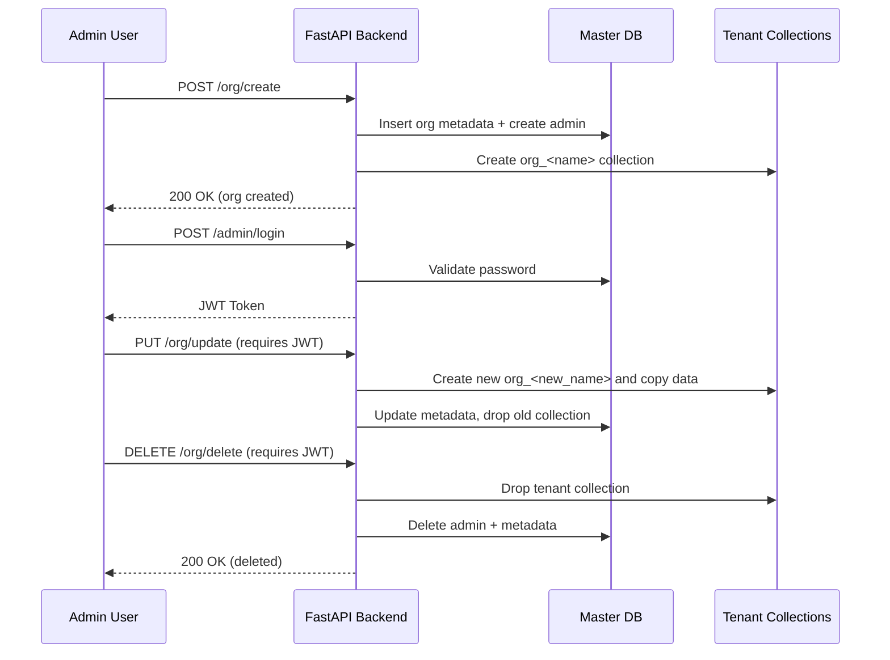

# Organization Management Service — Backend Intern Assignment

**Role:** Backend Engineering Intern  
**Stack:** FastAPI, Motor (async MongoDB driver), PyMongo, Pydantic, JWT, bcrypt.

---

## What I implemented
- `POST /org/create` — Create organization, create dynamic tenant collection (`org_<name>`), create admin (hashed password), and save metadata in master DB.
- `GET /org/get?organization_name=...` — Read organization metadata from the master DB.
- `PUT /org/update` — Rename organization (creates new tenant collection, copies data, drops old collection) and update admin details.
- `DELETE /org/delete` — Protected endpoint. Only admin with valid JWT (organization claim) can delete their org; drops tenant collection, deletes admin(s) and metadata.
- `POST /admin/login` — Admin login returns a JWT containing `admin_id`, `admin_email`, and `organization`.

---

## Quick start

1. Clone:
```bash
git clone <your-repo-url>
cd org-service
```

2. Create virtualenv and install:
```bash
python -m venv .venv
# Windows
.venv\Scripts\Activate.ps1
# macOS/Linux
source .venv/bin/activate

pip install -r requirements.txt
```

3. Add .env (copy .env.example) and update:
```bash
MONGO_URI=<your-mongodb-uri>
MASTER_DB=master_db
JWT_SECRET=<a-strong-secret>
JWT_ALGORITHM=HS256
JWT_EXP_MINUTES=60
```

4. Run:
```bash
uvicorn app.main:app --reload --host 127.0.0.1 --port 8000
```
---

## API examples (curl / PowerShell)

Create org:
```bash
curl -X POST "http://127.0.0.1:8000/org/create" -H "Content-Type: application/json" -d '{
  "organization_name": "TestCo",
  "email": "admin@testco.com",
  "password": "TestPass123"
}'
```
Admin login:
```bash
curl -X POST "http://127.0.0.1:8000/admin/login" -H "Content-Type: application/json" -d '{
  "email": "admin@testco.com",
  "password": "TestPass123"
}'
```
Delete org (use returned token):
```bash
curl -X DELETE "http://127.0.0.1:8000/org/delete?organization_name=TestCo" -H "Authorization: Bearer <TOKEN>"
```
---

## Design notes & trade-offs

- Single DB, multiple collections: Good for POC and small scale. For stronger isolation, use a separate DB per tenant or separate clusters.

- Dynamic collection creation: Implemented via sanitized collection names (org_<name>). Renaming copies documents to new collection then drops old; in prod, consider using renameCollection (needs admin privileges) or Mongo transactions for atomicity.

- Auth: JWT-based tokens with organization claim to protect destructive ops.

- Security improvements (not implemented due to scope): HTTPS, rate limiting, audit logs, admin email verification, refresh tokens, secrets manager for JWT secret.

- Scalability: For many tenants, use connection pooling, per-tenant DBs, sharding, or multi-cluster architecture.

---

## Architecture Diagram

---

## Additional Questions — Architecture, Scalability & Trade-offs

This design works well for a lightweight multi-tenant POC, but has several trade-offs:

### 1. Is this a scalable architecture?
For small-to-medium workloads: yes.  
Each organization receives an isolated collection (`org_<name>`), and the master DB stores only metadata.  
MongoDB handles horizontal scaling well, and collection-level isolation is lightweight and fast.

For large-scale scenarios:
- The number of collections may grow very large.
- Writes during rename operations involve copying data.
- A single database may become a bottleneck in high-traffic deployments.

### 2. Trade-offs in the tech stack & design choices
- **MongoDB** makes dynamic collection creation easy, but lacks strong transactional guarantees across collections.
- **FastAPI + Motor** is great for async IO, but Python is not as CPU-efficient as Go/Node for extremely high RPS scenarios.
- **JWT without refresh tokens** is simple, but requires careful rotation strategy in production.
- **Single database, multiple collections** is simple, but does not give the strict isolation that separate DBs or clusters would.

### 3. How I would design something better (production-grade)
- Use **separate databases per tenant** (not just collections).
- Use **MongoDB's `renameCollection`** for renaming instead of manual copy-drop.
- Add **rate limiting, audit logs, login attempts tracking**.
- Move secrets to **AWS Secrets Manager / HashiCorp Vault**.
- Add **refresh tokens + rotating JWT secrets**.
- Implement **OpenTelemetry tracing** for request paths.

